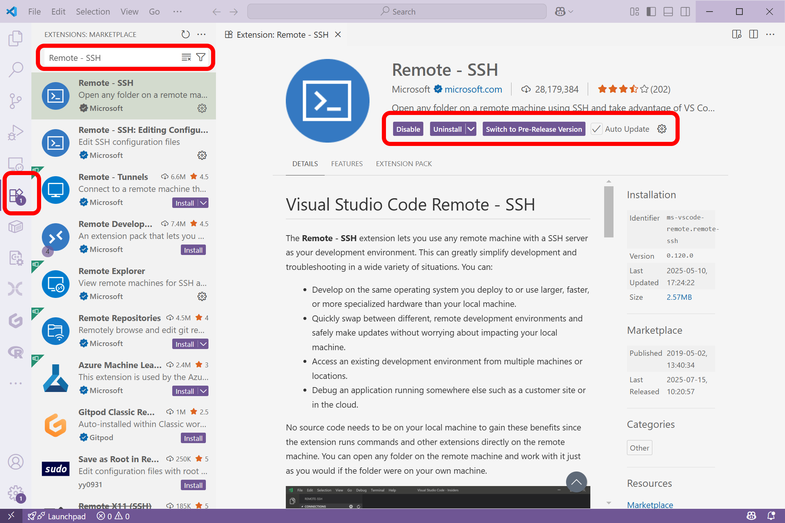
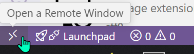

---
date:
  created: 2025-08-08
  #Sometimes, bloggers need to update a post. This might happen when you make a mistake or when something changes that you need to reflect in the post. To indicate you have edited a post, you can include an updated date in the page header.
  updated: 2025-09-03

categories:
  - Software

#Title will change how it's displayed on website
title: VS Code on RCAC Resources

#Slug will change how it's shown in the domain url
slug: vscode_rcac

tags:
  - Login
  - VS Code
authors:
  - glentner
  - remender
  - aseethar
  - jin456
---

# VS Code on RCAC Resources

Visual Studio Code (VS Code or Code) is a popular IDE growing in usage in HPC. It is particularly useful for less-technical researchers (relative to say, Vim), because of it's remote development capabilities.


<!-- more -->

---

## 1. VS Code Installation

- Download the installer for your operating system from the [VS Code website](https://code.visualstudio.com).
- Run the installer and follow the prompts to complete the installation.
- Launch VS Code after the installation is complete.

## 2. Install "Remote - SSH" Extension

- Open VS Code.
- Go to the Extensions view by clicking on the Extensions icon in the Activity Bar on the side.
- Search for "Remote - SSH" in the Extensions Marketplace.
- Click "Install" to add the extension to your VS Code setup.



## 3. Set Up SSH Keys

If you haven't already set up SSH keys (check `ls ~/.ssh/id_rsa`), follow these steps (on your local machine):

```bash
# Generate SSH keys (if you don't have them already)
ssh-keygen -b 4096 -C "pete@purdue.edu"
# Press Enter to accept the default file location and leave the passphrase empty for simplicity
ssh-copy-id -i ~/.ssh/id_rsa.pub pete@gautschi.rcac.purdue.edu
# Repeat for other clusters (negishi, bell, anvil)
# eg., ssh-copy-id -i ~/.ssh/id_rsa.pub pete@negishi.rcac.purdue.edu
```

This should allow you to log in to the RCAC clusters without entering a password each time.


## 4. Modify SSH Config File

Open your SSH config file (`~/.ssh/config`) in a text editor/VScode and add the following entries for each RCAC cluster:

``` title="~/.ssh/config"
Host gautschi
    HostName login03.gautschi.rcac.purdue.edu
Host negishi
    HostName login03.negishi.rcac.purdue.edu
Host bell
    HostName bell-fe03.rcac.purdue.edu

Match host *.rcac.purdue.edu
	User pete
	Port 22
	IdentityFile ~/.ssh/id_rsa
	StrictHostKeyChecking no
```

!!! tip "Tip for setting VS Code config file"
    We’ve created three connection targets, `gautschi`, `negishi` and `bell`. They will each create a VS Code session on the login node once you connect to it with VS Code. This is fine; notice how it’s targeting a specific `login03` or `fe03`. 

    **It doesn’t matter which one it is but pick the same one and stick to it so you don’t orphan your code server**.

## 5. Connect to the RCAC cluster using VS Code's Remote - SSH

You can connect to the RCAC clusters using VS Code's Remote - SSH extension:

**Option 1:**

Click on the left bottom corner of VS Code where it says "Open a Remote Window" and select "Remote-SSH: Connect to Host...". Then choose the cluster you want to connect to (e.g., `gautschi`, `negishi`, or `bell`).



**Option 2:**

Open the Command Palette (Ctrl+Shift+P) and type "Remote-SSH: Connect to Host..." and select the desired RCAC cluster (e.g., gautschi, negishi, bell) from the list of configured hosts.


**Option 3:**

Click on the Remote Explorer icon in the Activity Bar on the side, then click on the "SSH Targets" section. You should see the RCAC clusters listed there. Click on the one you want to connect to.

Once connected, you can open files, run commands, and manage your projects on the cluster directly from VS Code.

## 6. Use VS Code on a Compute Node

Follow all steps from step 1 to step 3 on this page. Instead of creating only one `Host` for a login node (frontend), we can have both `xxx-login` and `xxx-compute` hosts set that direct to one specific login node and one specific compute node, respectively. 

``` title="~/.ssh/config"
Host gautschi-login
	HostName login03.gautschi.rcac.purdue.edu
Host gautschi-compute
	HostName a016.gautschi.rcac.purdue.edu
	ProxyCommand ssh -q -W %h:%p gautschi-login

Host negishi
    HostName login03.negishi.rcac.purdue.edu
Host bell
    HostName bell-fe03.rcac.purdue.edu

Match host *.rcac.purdue.edu
	User x-user
	Port 22
	IdentityFile ~/.ssh/id_rsa
	StrictHostKeyChecking no
```

!!! Note "Compute Node Host Configuration"
    In the above example, we’ve created two connection targets for `gautschi`, `gautschi-login` and `gautschi-compute`.  To use VS Code with a compute node as part of a job, with more/dedicated resources, **you’ll need to get an allocation outside of VS Code** (i.e. you need to have active jobs running on that node using e.g. `sinteractive`) and note the hostname (which node) the job is on and alter the HostName in your `~/.ssh/config` before connecting.

