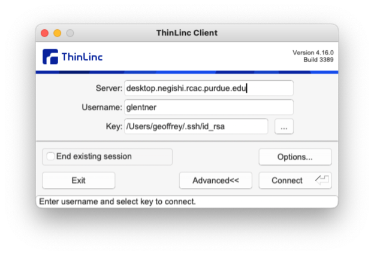
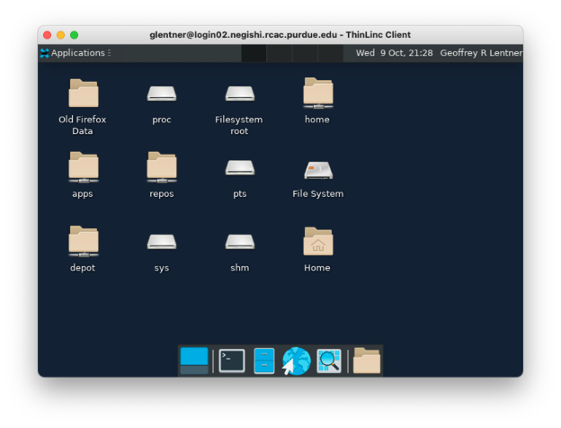
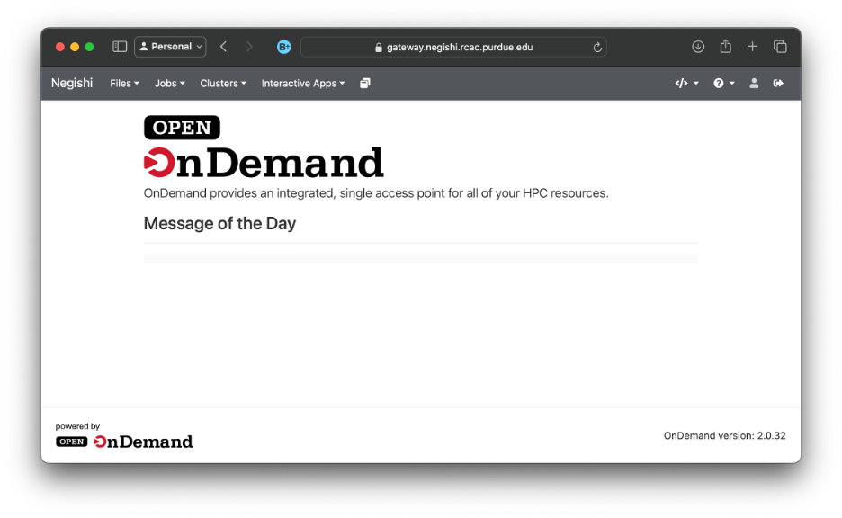

### How to Access the Clusters
[Week 2 Index](week2.md)

**Previous section:** [Purdue Clusters](clusters.md)

In this section, we will talk about how to actually access, or get onto the cluster(s).

There are three main ways to get onto the cluster(s):
1. ssh
2. ThinLinc
3. Open on Demand (gateway)

We will discuss each of these options and you can choose which option(s) makes the most sense for you.

### ssh
`ssh` is the simplest way to access the cluster. Most UNIX systems (such as Linux and macOS) have the `ssh` program already installed. Windows 11 comes with the `ssh` program already there as well. To use `ssh`, open a Terminal (in any system). And use the command:
```bash
$ ssh USERNAME@CLUSTER.rcac.purdue.edu
```
Where `USERNAME` is replaced with your Purdue username and `CLUSTER` is replaced with the cluster you are trying to access.

You should see something that looks like this:
```bash
************************************************************

***** Use of Purdue BoilerKey or SSH keys is Required ******

************************************************************

(USERNAME@CLUSTER.rcac.purdue.edu) Password:
```
Here you enter your Purdue password appended with a ',push'. So you should enter in 'password,push'. It will not look like anything is being typed. But the characters are being entered. This is a security feature of `ssh` so that people don't know how long your password is.

Once you enter your password and hit the enter key, it will prompt a Duo push on your phone. Once you approve the Duo push, you will be logged in (if you have been granted access to the cluster you are trying to get into).

When you're logged in, your prompt should change to be of the form of:
```bash
USERNAME@loginXX.CLUSTER:[~] $
```
You're now ready to do things on the cluster!

### ThinLinc
ThinLinc is an alternative we provide if you would like a more familiar GUI-based interface. There are two ways to use ThinLinc: the browser version and the desktop version. The desktop version requires a download, but it has a couple more features that the browser version doesn't have. Specifically, you can use ssh keys as well as restart your session in the desktop version, which you can't do in the browser version.

You can download the desktop ThinLinc client from Cendio here: [Cendio](https://www.cendio.com/thinlinc/download/)

Otherwise, if you want to use the browser version, simply open up your favorite internet browser and navigate to `desktop.CLUSTER.rcac.purdue.edu`, where `CLUSTER` is replaced with the name of the cluster you want to access.



You may need to click the `Advanced` button to see everything you need to. The Server here is `desktop.CLUSTER.rcac.purdue.edu`, where `CLUSTER` is replaced with the name of the cluster you want to access. The username is your Purdue username and password is your Purdue password appended with ',push'. That is, it would be 'password,push'. For the desktop version, you will see one or two windows pop up that you just need to click through and then it will prompt two Duo pushes, that you need to approve. After you're logged in, you'll see something that looks like this:



Use ThinLinc, either the browser or desktop version, if you want to run any kind of graphical application, like Matlab for example.

ThinLinc is also nice because the sessions are persistent; it will hold onto your applications and running shells unless you don't log in for 2 weeks.

### Open on Demand
Open on Demand, also known as the Gateway, is a modern web interface to our HPC resources. You don't need to open a terminal, or understand a UNIX command-line shell. Although, you can open a shell from it. You can check/edit files and organize your data through the web interface. You can even request interactive compute sessions with apps such as Jupyter, RStudio, Matlab, etc.

To log in to Open on Demand, open your internet browser and navigate to `gateway.CLUSTER.rcac.purdue.edu`, where `CLUSTER` is again replaced with the name of the cluster you are trying to access. After you log in through Purdue's normal Single Sign On page, you should see something like this:



**Next section:** [File Storage and Transfer](files1.md)
