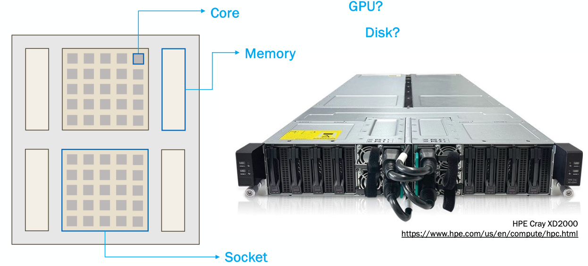

# What is a cluster?

[Week 2 Index](week2.md)

**Previous section:** [Applications](applications.md)

Since we've now learned how to interact with the cluster and run programs on it, what actually is a cluster? A cluster is built from many **servers**, which are **interconnected** over fast networks, attached to one or more **data** storage systems. They typically run a **UNIX**-like operating system and are managed by a batch **scheduler**. They often run special **software**.

So what are these servers that make up the clusters? They're all just computers! They look a certain way and live in a data center so they are technically servers, but when referring to a single server as a unit within a cluster of machines, **node** suggests membership in a group. They have many names, such as: node, computer, server, machine, host.

Different nodes can also have different purposes, such as **login** vs. **compute** vs. **data**. We will get into this distinction more later in this section.

Here is what a node looks like and what it is made up of:

Each node has one or more sockets that are each made up of a number of cores. Each socket has its own memory associated with it. There are many other components that can make up a node, such as disk space, or GPUs.

Most clusters are broken up into two main parts: the front end or login nodes and the compute or back end nodes. When you log into the cluster, you are put onto a login node, which is limited in resources and not suitable for doing actual research. You need to interact with the scheduler (which we will talk about in the next section [jobs](jobs.md)) to move from the login nodes to the compute nodes.

Before we get started with how to do that, we should talk about the two paradigms of running code on a supercomputer:

* Interactively
* Batch mode

In the interactive paradigm, you get a session on a compute node (using the gateway, ssh, or ThinLinc), and then run your code directly. However, if your network drops, your code could be interrupted.

In the batch paradigm, you write your code, and then submit one (or many) instances of your code using the scheduler and it can run on arbitrarily many nodes without worry of interruption.

**Next section:** [Submit Jobs Using the Scheduler](jobs.md)
