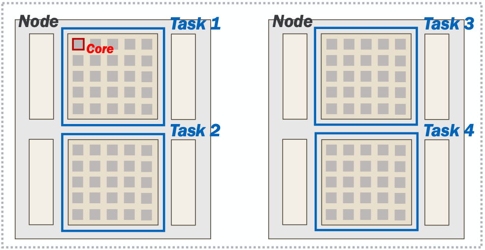

# Multinode jobs and topology

[Week 4 Index](week4.md)

**Previous section:** [File storage and transfers](files2.md)

In jobs, you can also request jobs that span over two or more nodes, these are called **multinode** jobs and have special things to consider when running them.

You can request jobs that have different "shapes", such as the layout of the following command:
```bash
sbatch -N2 --ntasks-per-node=2 --cpus-per-task=64...
```
Here, the job encompasses two nodes, with two tasks on each node, and 64 cores assigned to each task. The layout looks like this:



As mentioned earlier, the `hostname` program prints out the hostname of the server we are currently on.

The `srun` launcher is part of Slurm and will bring up copies of your program within the allocation according to the number of tasks in your request.

Submit the following job script (or variations of it) to get a sense of how we can launch copies of a program across an allocation. Name the job script `hostname.sh`
```bash
#!/bin/bash
#SBATCH -A lab_queue -p cpu -q standby
#SBATCH -N2 --ntasks-per-node=2 --cpus-per-task=64
#SBATCH -t 00:10:00

srun hostname
```
Distributed workflows rely on application *instances* working together between nodes.

Submit your job to the scheduler using the `sbatch` program:
```bash
$ sbatch hostname.sh
Submitted batch job 19804935
```
You can check on the job status using the command `squeue --me`:
```bash
$ squeue --me
JOBID      USER         ACCOUNT     NAME          NODES   CPUS  TIME_LIMIT ST TIME
19804935   username   lab_queue     hostname.sh       2    256    00:10:00 PD 00:00
```
If you don't see anything in the output of `squeue --me`, that's because your job already finished. We will discuss how to see past jobs in the next section: [Job History](history.md). If this happens, use the job ID that was put out by the `sbatch` command.

Remember that the job ID will be used for the output filename (e.g. `slurm-19804935.out`). You can use the `cat` program to show the output stored in the file:
```bash
$ cat slurm-19804935.out
a200.negishi.rcac.purdue.edu
a200.negishi.rcac.purdue.edu
a209.negishi.rcac.purdue.edu
a209.negishi.rcac.purdue.edu
```
What did you notice in the output file of this job? Do the hostnames align with what you expected based on the request? How would we capture the output of each of these tasks (job steps) separately?

??? note "Answer"

    We could use `srun`'s `--output` option e.g.:
    ```bash
    --output %j-%t-%s.out
    ```
    Where `%j` is the job ID, `%t` is the task ID and `%s` is the step ID.

We cannot go too deep into the nuances of distributed software development or MPI-based applications in this workshop. It is still important to understand that your job script does **not automatically start running on other nodes in your job**.

But, we've learned that it is *possible* to orchestrate multiple tasks in parallel across nodes. More on this in this week's session: [Managing Workloads and Jobs](workloads.md).

**Next section:** [Job History](history.md)
